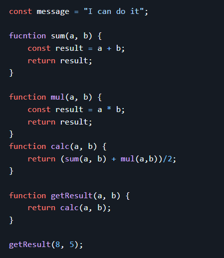
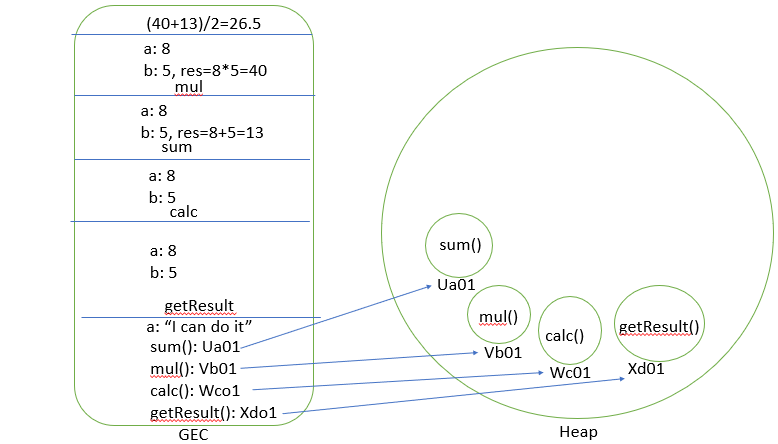
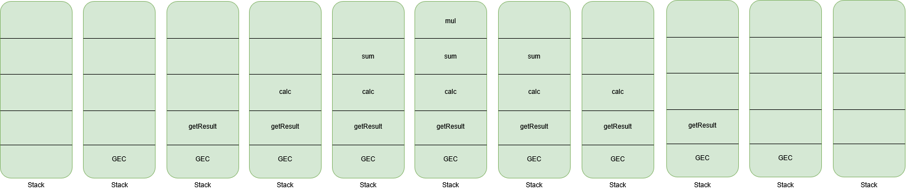

1. Create the GEC and FEC with CP and EP flow

GEC:
CP:
message : undefined
sum()   : f() in memory
mul()   : f() in memory
calc()  : f() in memory
getResult() : f() in memory

EP:
message = "I can do it"
getResult : Execute
FEC (for getResult)
CP:
    a : 8  
    b : 5  

EP:
    calc : Execute  

    FEC (for calc)
    CP:
        a : 8  
        b : 5  

    EP:
        sum() : Execute  

        FEC (for sum)
        CP:
            a : 8  
            b : 5  
            result : undefined  

        EP:
            result = a + b = 8 + 5 = 13  

        mul() : Execute  

        FEC (for mul)
        CP:
            a : 8  
            b : 5  
            result : undefined  

        EP:
            result = a * b = 8 * 5 = 40  

        calc = (add + mul) / 2  
        (13 + 40) / 2 = 26.5

2. Create the Stack and Heap Flow

3. Create the Stack Diagram

